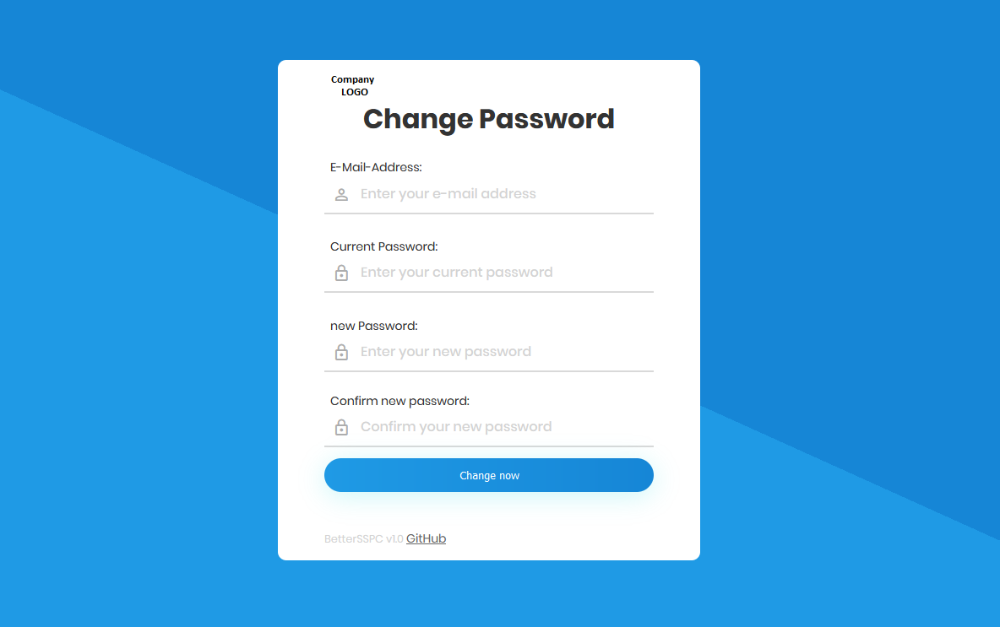

# BetterSSPC

This is a tool for a better self-service password change

## Requirements
You need a webserver in your domain with PHP7 and actiavted LDAP extension.

## Install
Put everything from 'source' on your webserver.

## Config
For configuration, all you have to do is change the variables in config.php.

You can change every text via variable to completly translate the app to your language. 

## License
GNU General Public License v3

You can change the source code and use this software for commercial usage.

You are not allowed to make profit with this software.
